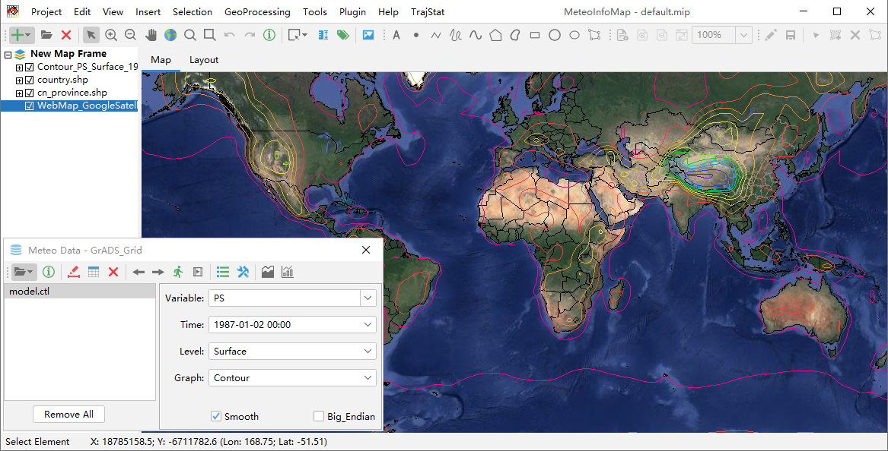
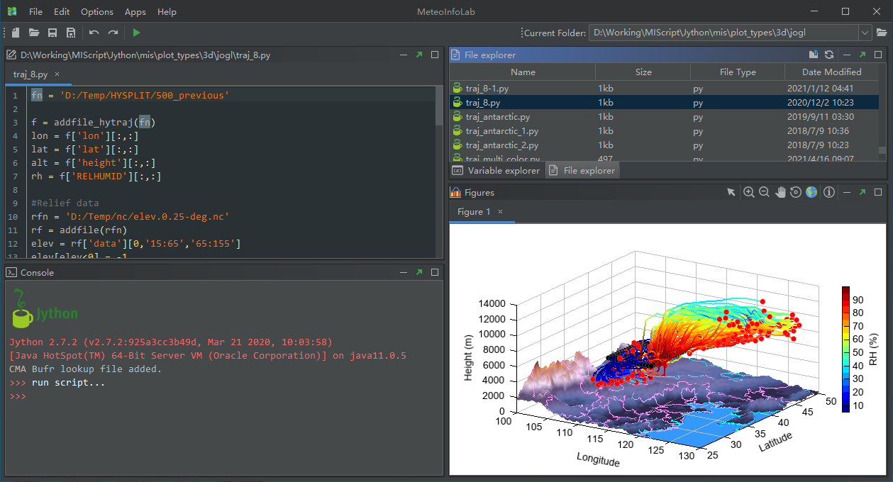

MeteoInfo: GIS and scientific computation environment for meteorological community
==================================================================================

**MeteoInfo** is an intergrated framework both for GIS application (**MeteoInfoMap**) and scientific computation environment (**MeteoInfoLab**), especially for meteorological community.

**MeteoInfoMap** is a GIS application which enables the user to visualize and analyze
the spatial and meteorological data with multiple data formats.

  
**MeteoInfoLab** is a scientific computation and visualization environment using Jython scripting with the 
ability of multiple dimensional array calculation and 2D/3D plotting.

**MeteoInfoLib** is a Java library providing main functions of MeteoInfoMap and MeteoInfoLab.

It requires that Java 8 or greater be installed on your computer. See the
http://www.java.com website for a free download of Java if you do not have it
already installed.

Documentation
-------------

Learn more about MeteoInfo in its official documentation at http://meteothink.org/

Publication
-----------

- Wang, Y.Q., 2014. MeteoInfo: GIS software for meteorological data visualization and analysis. Meteorological Applications, 21: 360-368.
- Wang, Y.Q., 2019. An Open Source Software Suite for Multi-Dimensional Meteorological Data Computation and Visualisation. Journal of Open Research Software, 7(1), p.21. DOI: http://doi.org/10.5334/jors.267

Get in touch
------------

- Report bugs, suggest features or view the source code [`_on GitHub`](http://github.com/meteoinfo/MeteoInfo)

License
-------

Copyright 2010-2020, MeteoInfo Developers

Licensed under the LGPL License, Version 3.0 (the "License");
you may not use this file except in compliance with the License.
You may obtain a copy of the License at

  http://www.gnu.org/licenses/lgpl.html

Unless required by applicable law or agreed to in writing, software
distributed under the License is distributed on an "AS IS" BASIS,
WITHOUT WARRANTIES OR CONDITIONS OF ANY KIND, either express or implied.
See the License for the specific language governing permissions and
limitations under the License.
